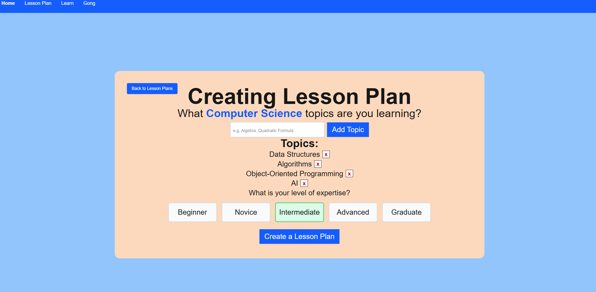
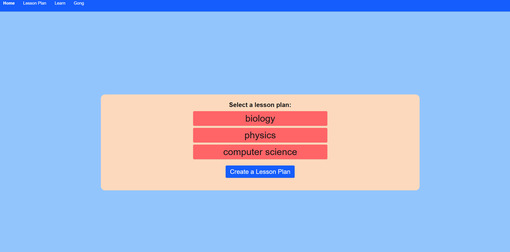
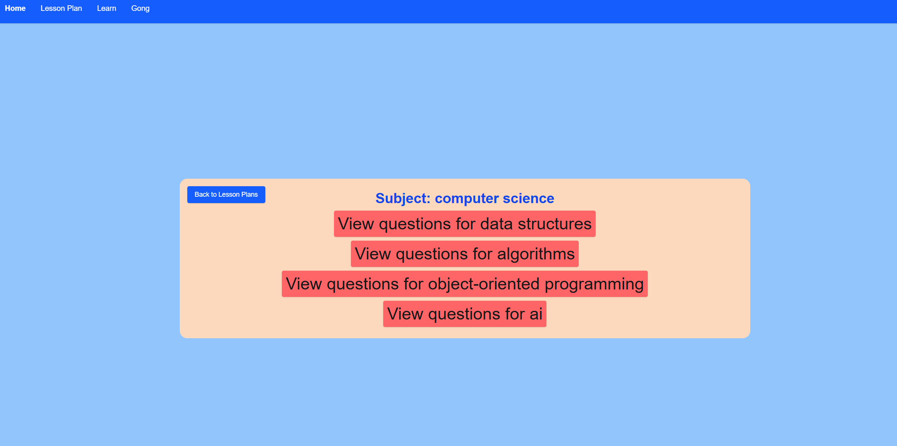
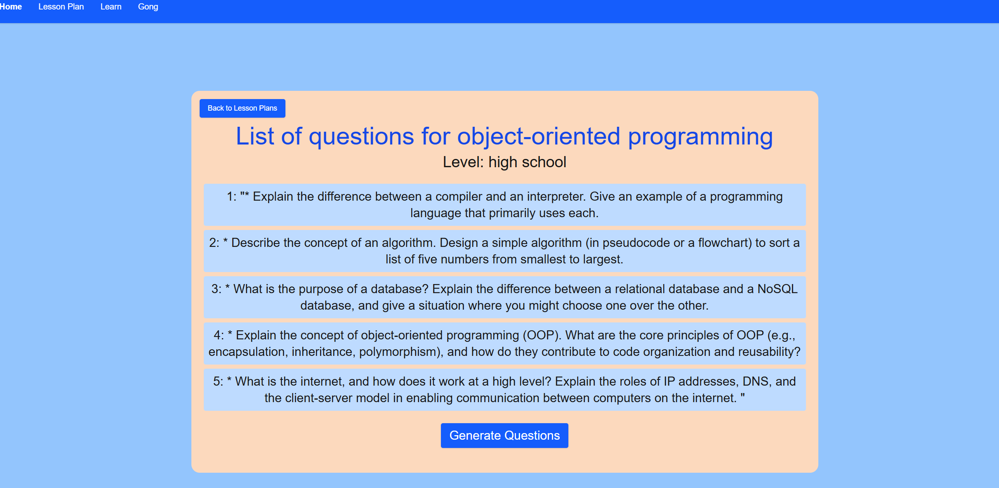
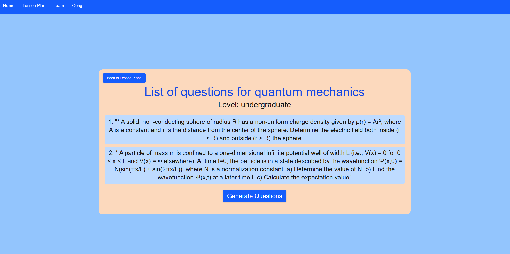
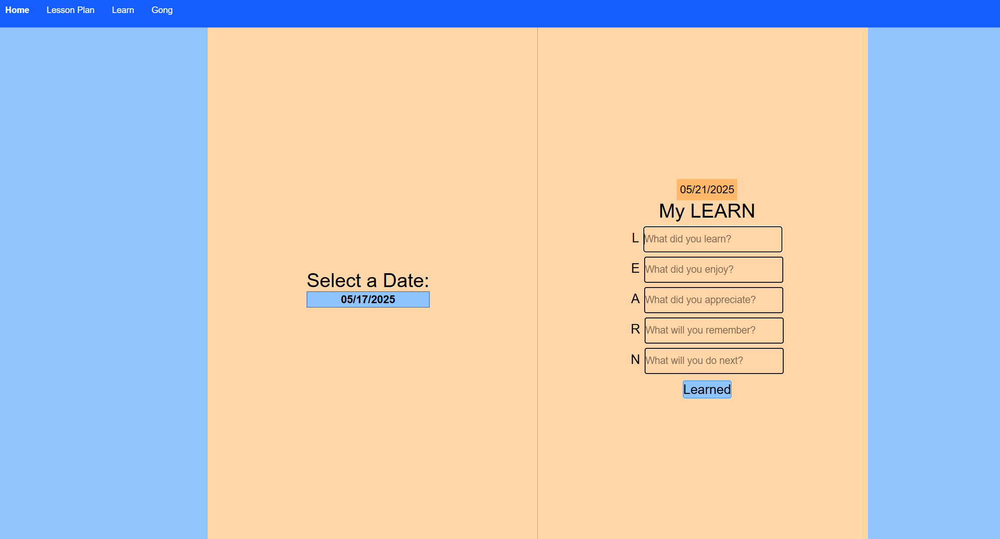
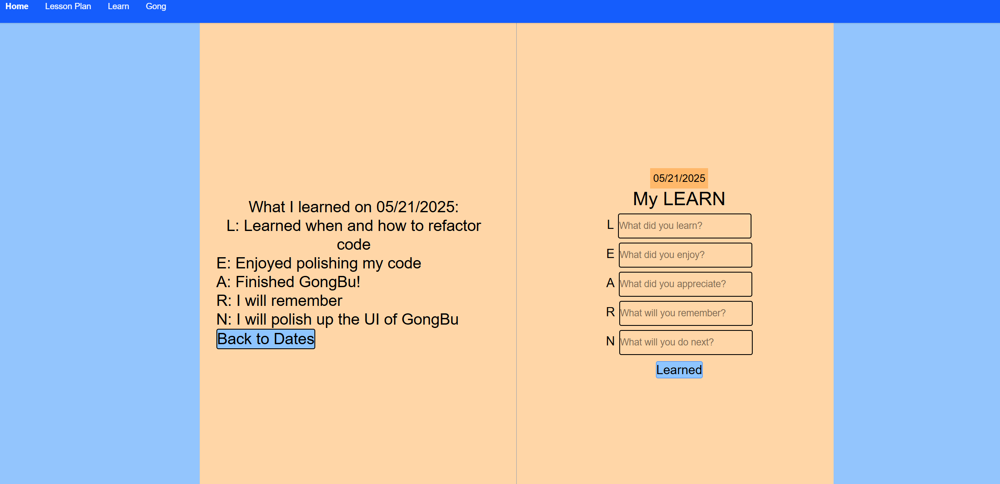

# GongBu
Showcase for GongBu, an AI-powered learning tool.
The purpose of this project is to help people learn, retain, and master specific topics through lowering the barrier of entry of researching a topic by simply and clicking through the project.

You can create your own lesson plan on whatever subject youre studying.

You can also add how proficient you are at each specific topic to generate more relevant questions.

Your curated lesson plans are organized by subjects and topics.

Clicking on a topic will show you AI-generated questions for you to answer and study.

And it's not limited to only one subject!

You can journal what you've LEARNed daily to help retain knowledge and organize your thoughts.

You can look at what you have LEARNed in the past to joggle your memory and show how far you have come.

